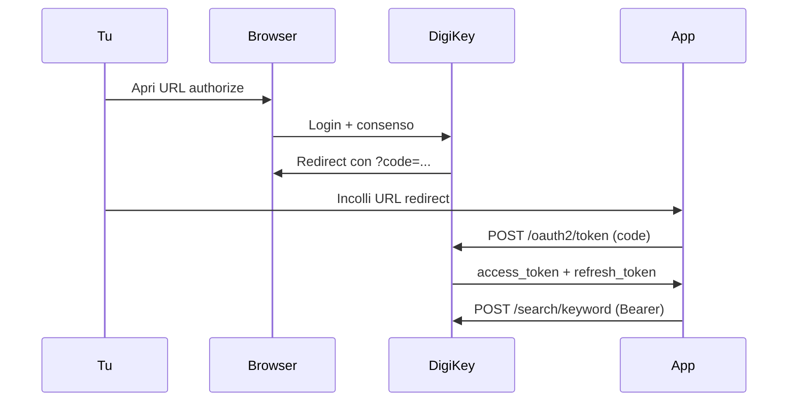

# DigiKey API — Guida per ComponentVault

Documentazione ufficiale: [developer.digikey.com](https://developer.digikey.com/documentation)

## Perché il vecchio script non funzionava

Il file `testdigikey.py` in `/Users/michelebigi/LCSC/` aveva **URL sbagliati**:

| Cosa | Sbagliato | Corretto |
|------|-----------|----------|
| Token | `https://digikey.com` | `https://api.digikey.com/v1/oauth2/token` |
| Authorize | `https://digikey.com` | `https://api.digikey.com/v1/oauth2/authorize` |
| Search | `https://digikey.com` | `https://api.digikey.com/products/v4/search/keyword` |

Inoltre il `redirect_uri` deve coincidere **esattamente** con quello registrato nel portale DigiKey (incluso `/` finale).

## Flusso OAuth (3-legged) — come spiega DigiKey



## Setup nel portale DigiKey

1. Vai su [developer.digikey.com](https://developer.digikey.com/) → **My Apps**
2. Verifica che l'app sia iscritta a **Product Information V4**
3. **Redirect URI** deve essere identico a `callback_url` in `digikey_config.yml`:
   ```
   http://localhost:8000
   ```
   Se non funziona, prova `https://localhost` (consigliato da DigiKey)

## Autenticazione (prima volta)

```bash
pip3 install requests pyyaml
python3 ~/Documents/Develop/ComponentVault/Tools/digikey_auth.py
```

1. Si apre un URL — fai login DigiKey
2. Copia l'URL completo dalla barra (con `?code=…`)
3. Incollalo nel terminale
4. Il token viene salvato in `/Users/michelebigi/LCSC/digikey_token_cache.json`

## Test ricerca

```bash
python3 ~/Documents/Develop/ComponentVault/Tools/digikey_auth.py --search INA219AIDR
```

## Header richiesti per ogni chiamata API

```
Authorization: Bearer {access_token}
X-DIGIKEY-Client-Id: {client_id}
X-DIGIKEY-Locale-Site: IT
X-DIGIKEY-Locale-Language: it
X-DIGIKEY-Locale-Currency: EUR
Content-Type: application/json
```

## Config (`digikey_config.yml`)

Già presente in `/Users/michelebigi/LCSC/digikey_config.yml` — **non committare** (contiene secret).

## Prossimo passo in ComponentVault

Quando l'autenticazione Python funziona, l'app macOS leggerà `digikey_token_cache.json` e potrà arricchire componenti per **MPN** con il pulsante "Aggiorna da DigiKey".

## Errori comuni

| Errore | Causa | Soluzione |
|--------|-------|-----------|
| `invalid_redirect_uri` | URI non coincide col portale | Allinea `callback_url` nel YAML |
| `Bearer token error` | Header Authorization mancante | Aggiungi `Bearer ` prima del token |
| `401 Unauthorized` | Token scaduto | `python3 digikey_auth.py --refresh` |
| `403` | App non iscritta a Product V4 | Abilita API nel portale |
