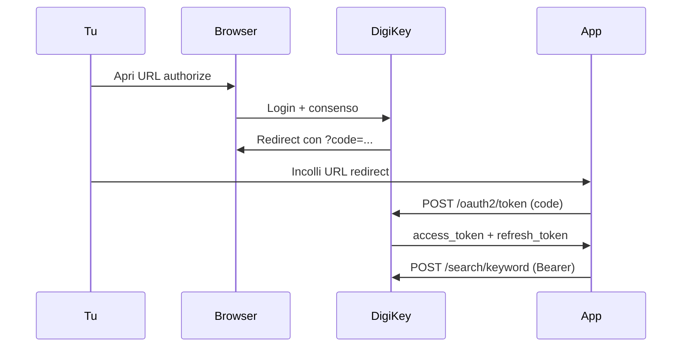

# DigiKey API — Guida per ComponentVault

Documentazione ufficiale: [developer.digikey.com](https://developer.digikey.com/documentation)

## Perché il vecchio script non funzionava

Il file `testdigikey.py` in `/Users/michelebigi/LCSC/` aveva **URL sbagliati**:

| Cosa | Sbagliato | Corretto |
|------|-----------|----------|
| Token | `https://digikey.com` | `https://api.digikey.com/v1/oauth2/token` |
| Authorize | `https://digikey.com` | `https://api.digikey.com/v1/oauth2/authorize` |
| Search | `https://digikey.com` | `https://api.digikey.com/products/v4/search/keyword` |

Inoltre il `redirect_uri` deve coincidere **esattamente** con quello registrato nel portale DigiKey (incluso `/` finale).

## Flusso OAuth (3-legged) — come spiega DigiKey



## Setup nel portale DigiKey

1. Vai su [developer.digikey.com](https://developer.digikey.com/) → **My Apps**
2. Verifica che l'app sia iscritta a **Product Information V4**
3. **Sandbox vs Production** — le credenziali non sono intercambiabili:
   - App **Sandbox** → `environment: sandbox` nel YAML
   - App **Production** → `environment: production` nel YAML
4. **Redirect URI** — Production richiede **HTTPS** con porta esplicita:
   ```
   https://localhost:8443/digikey/callback
   ```
   Sandbox può usare `http://localhost:8000`
   - Deve coincidere **esattamente** con `callback_url` nel YAML

## Autenticazione (prima volta)

### Opzione A — dall'app (consigliata)

1. Apri **Impostazioni → DigiKey**
2. Clicca **Apri login DigiKey**
3. Se richiesto, accetta il certificato TLS locale
4. Fai login e consenti l'accesso — il token si salva automaticamente

### Opzione B — da terminale

```bash
pip3 install requests pyyaml
python3 ~/Documents/Develop/ComponentVault/Tools/digikey_auth.py
```

1. Si apre un URL — fai login DigiKey
2. Copia l'URL completo dalla barra (con `?code=…`)
3. Incollalo nel terminale
4. Il token viene salvato in `/Users/michelebigi/LCSC/digikey_token_cache.json`

## Test ricerca

```bash
python3 ~/Documents/Develop/ComponentVault/Tools/digikey_auth.py --search INA219AIDR
```

## Header richiesti per ogni chiamata API

```
Authorization: Bearer {access_token}
X-DIGIKEY-Client-Id: {client_id}
X-DIGIKEY-Locale-Site: IT
X-DIGIKEY-Locale-Language: it
X-DIGIKEY-Locale-Currency: EUR
Content-Type: application/json
```

## Config (`digikey_config.yml`)

```env
client_id: '...'
client_secret: '...'
environment: 'sandbox'   # oppure production
callback_url: 'http://localhost:8000'
market: 'IT'
currency: 'EUR'
language: 'it'
```

## Arricchimento in ComponentVault (v0.5)

- **Dettaglio componente** → pulsante **DigiKey** (richiede MPN + token)
- **Inventario** → pulsante **DigiKey** per arricchire in bulk la lista filtrata
- Se DigiKey restituisce più risultati, appare una sheet di scelta
- Link **Apri su DigiKey** nel dettaglio dopo l'arricchimento

### Batch offline

```bash
python3 ~/Documents/Develop/ComponentVault/Tools/digikey_enrich.py \
  --csv "/Users/michelebigi/LCSC/Componenti Elettronici.csv"
```

Output in `/Users/michelebigi/LCSC/digikey_json_data/{LCSC}.json`

## Errori comuni

| Errore | Causa | Soluzione |
|--------|-------|-----------|
| `Invalid clientId` | Credenziali sandbox usate su API production (o viceversa) | Imposta `environment: sandbox` o crea app Production |
| `invalid_redirect_uri` | URI non coincide col portale | Allinea `callback_url` nel YAML |
| `Bearer token error` | Header Authorization mancante | Aggiungi `Bearer ` prima del token |
| `401 Unauthorized` | Token scaduto | `python3 digikey_auth.py --refresh` |
| `403` | App non iscritta a Product V4 | Abilita API nel portale |
