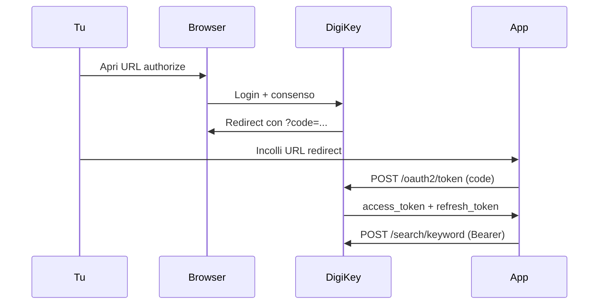

# DigiKey API — Guida per ComponentVault

Documentazione ufficiale: [developer.digikey.com](https://developer.digikey.com/documentation)

## Perché il vecchio script non funzionava

Il file `testdigikey.py` in `/Users/michelebigi/LCSC/` aveva **URL sbagliati**:

| Cosa | Sbagliato | Corretto |
|------|-----------|----------|
| Token | `https://digikey.com` | `https://api.digikey.com/v1/oauth2/token` |
| Authorize | `https://digikey.com` | `https://api.digikey.com/v1/oauth2/authorize` |
| Search | `https://digikey.com` | `https://api.digikey.com/products/v4/search/keyword` |

Inoltre il `redirect_uri` deve coincidere **esattamente** con quello registrato nel portale DigiKey (incluso `/` finale).

## Flusso OAuth (3-legged) — come spiega DigiKey



## Setup nel portale DigiKey

1. Vai su [developer.digikey.com](https://developer.digikey.com/) → **My Apps**
2. Verifica che l'app sia iscritta a **Product Information V4**
3. **Sandbox vs Production** — le credenziali non sono intercambiabili:
   - App **Sandbox** → `environment: sandbox` nel YAML
   - App **Production** → `environment: production` nel YAML
4. **Redirect URI** — Production richiede **HTTPS** con porta esplicita:
   ```
   https://localhost:8443/digikey/callback
   ```
   Sandbox può usare `http://localhost:8000`
   - Deve coincidere **esattamente** con `callback_url` nel YAML

## Autenticazione (prima volta)

### Opzione A — dall'app (consigliata)

1. Apri **Impostazioni → DigiKey**
2. Clicca **Apri login DigiKey**
3. Se richiesto, accetta il certificato TLS locale
4. Fai login e consenti l'accesso — il token si salva automaticamente

### Opzione B — da terminale

```bash
pip3 install requests pyyaml
python3 ~/Documents/Develop/ComponentVault/Tools/digikey_auth.py
```

1. Si apre un URL — fai login DigiKey
2. Copia l'URL completo dalla barra (con `?code=…`)
3. Incollalo nel terminale
4. Il token viene salvato in `/Users/michelebigi/LCSC/digikey_token_cache.json`

## Test ricerca

```bash
python3 ~/Documents/Develop/ComponentVault/Tools/digikey_auth.py --search INA219AIDR
```

## Header richiesti per ogni chiamata API

```
Authorization: Bearer {access_token}
X-DIGIKEY-Client-Id: {client_id}
X-DIGIKEY-Locale-Site: IT
X-DIGIKEY-Locale-Language: it
X-DIGIKEY-Locale-Currency: EUR
Content-Type: application/json
```

## Config (`digikey_config.yml`)

```env
client_id: '...'
client_secret: '...'
environment: 'sandbox'   # oppure production
callback_url: 'http://localhost:8000'
market: 'IT'
currency: 'EUR'
language: 'it'
```

## Arricchimento in ComponentVault (v0.5–v0.7)

- **Dettaglio componente** → pulsante **DigiKey** (richiede MPN + token)
- **Dettaglio componente** → pulsante **Entrambi** (LCSC poi DigiKey, senza sovrascrivere l'altro fornitore)
- **Inventario** → pulsante **DigiKey** per arricchire in bulk la lista filtrata
- Se DigiKey restituisce più risultati, appare una sheet di scelta
- Link **Apri su DigiKey** nel dettaglio dopo l'arricchimento

### Confronto LCSC ↔ DigiKey (v0.7)

Ogni arricchimento salva uno **snapshot** separato (`lcscSnapshot`, `digikeySnapshot`). I campi in lista (prezzo, stock, ecc.) vengono aggiornati con la politica di merge (`refreshDisplayFields` — prezzo più conveniente per la qty in inventario).

| Azione | Effetto |
|--------|---------|
| **LCSC** | Aggiorna solo snapshot LCSC + dati tecnici |
| **DigiKey** | Aggiorna solo snapshot DigiKey + dati commerciali |
| **Entrambi** | Esegue LCSC, poi DigiKey; badge **LCSC + DigiKey** |

Nel dettaglio, la sezione **Confronto fornitori** mostra le due card affiancate con riepilogo risparmio. Filtri inventario: **Con dati DigiKey**, **DigiKey stock 0**.

### Ricerca progettazione — catalogo fornitori (v0.8)

**Catalogo → LCSC + DigiKey** — flusso per trovare componenti in fase di design:

1. Imposti **tipo + valore + footprint** (es. Resistenze · 10kΩ · 0805)
2. **DigiKey** cerca nel catalogo live → restituisce MPN e codice DigiKey
3. Con l'**MPN**, **LCSC** cerca nel catalogo live → restituisce codice `Cxxxxx`
4. Scheda con **entrambi i codici** affiancati
5. **Nel progetto** → importa in inventario e aggiunge alla BOM con designator

Requisiti LCSC live: `pip3 install gmssl requests` e script `Tools/lcsc_catalog_search.py`.

### Ricerca LCSC da MPN (v0.9)

Per ottenere il codice **Cxxxxx** a partire dal Manufacturer Part Number:

| Fonte | Come funziona |
|-------|----------------|
| **Inventario** | match esatto MPN normalizzato |
| **Archivio locale** | scan `~/LCSC/json_full_data/*.json` |
| **LCSC live** | `POST wmsc.lcsc.com/.../search/v3/global` con keyword=MPN (criptazione SM2) |

**In app:** Catalogo → Progettazione → scheda **Da MPN**, oppure dettaglio componente → **Trova LCSC**.

```bash
pip3 install gmssl requests
python3 ~/Documents/Develop/ComponentVault/Tools/lcsc_catalog_search.py --keyword "INA219AIDR"
```

L'API pubblica LCSC richiede la chiave SM2 dalla homepage; senza `gmssl` funziona solo l'archivio JSON locale.

### Esplora DigiKey — discovery (v0.9)

**Catalogo → Esplora DigiKey** — ricerca avanzata nel catalogo DigiKey:

| Modalità | Endpoint | Uso |
|----------|----------|-----|
| **Keyword** | `POST /products/v4/search/keyword` | MPN, descrizione, manufacturer |
| **Barcode** | stessa keyword search | lookup da codice a barre |
| **Sostituti** | `GET /products/v4/search/{pn}/substitutions` | cross-reference per parti obsolete |
| **Packaging** | `GET /products/v4/search/{pn}/alternatepackaging` | reel/cut-tape/tray alternativi |

Ogni risultato può essere **importato** in inventario con codice sintetico `DK-{partNumber}`.

### Progetti e alert DigiKey (v0.9)

**Progetti → dettaglio BOM**

- Barra riepilogo con **costo totale DigiKey** (somma righe con prezzo)
- Colonne **DigiKey PN** e **Prezzo DK** per riga
- Badge **OBS** per componenti obsoleti/NRND
- Pulsante **sostituti** su righe obsolete (cross-reference live)
- **Esporta BOM → BOM DigiKey (costi)** — CSV con prezzi, link ordine, stato, obsolescenza

**Alert scorte**

- Ogni riga mostra il **suggerimento riordino DigiKey** (stock + prezzo alla soglia)
- **Esporta DigiKey** — CSV alert con dati commerciali DigiKey

### Dati commerciali (v0.6)

Dopo l'arricchimento, l'app chiama automaticamente:

| Endpoint | Dati |
|----------|------|
| `GET /products/v4/search/{digikeyPN}/pricing` | Scaglioni prezzo (`StandardPricing`) |
| `GET /products/v4/search/{digikeyPN}/productdetails` | MOQ, lead time, stato prodotto |

Nel dettaglio componente compare la card **DigiKey — dati commerciali** con tabella scaglioni (riga evidenziata per la qty in inventario).

### Batch offline

```bash
python3 ~/Documents/Develop/ComponentVault/Tools/digikey_enrich.py \
  --csv "/Users/michelebigi/LCSC/Componenti Elettronici.csv"
```

Output in `/Users/michelebigi/LCSC/digikey_json_data/{LCSC}.json`

## Errori comuni

| Errore | Causa | Soluzione |
|--------|-------|-----------|
| `Invalid clientId` | Credenziali sandbox usate su API production (o viceversa) | Imposta `environment: sandbox` o crea app Production |
| `invalid_redirect_uri` | URI non coincide col portale | Allinea `callback_url` nel YAML |
| `Bearer token error` | Header Authorization mancante | Aggiungi `Bearer ` prima del token |
| `401 Unauthorized` | Token scaduto | `python3 digikey_auth.py --refresh` |
| `403` | App non iscritta a Product V4 | Abilita API nel portale |
